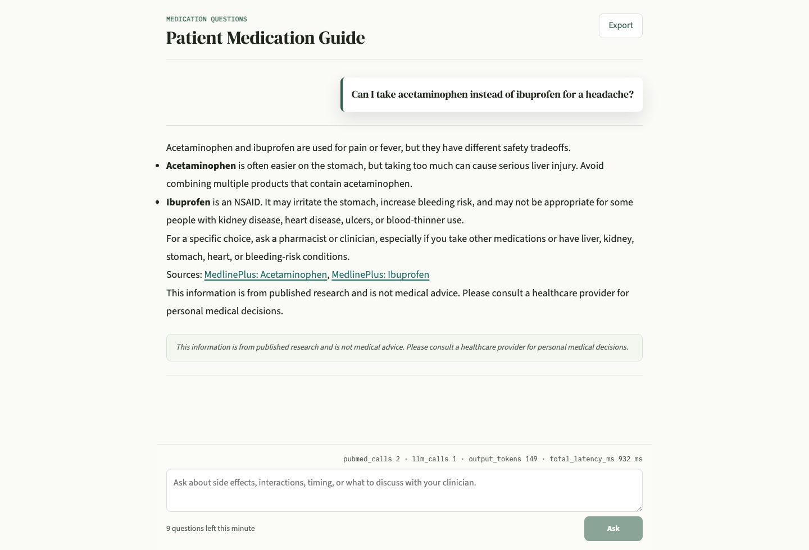
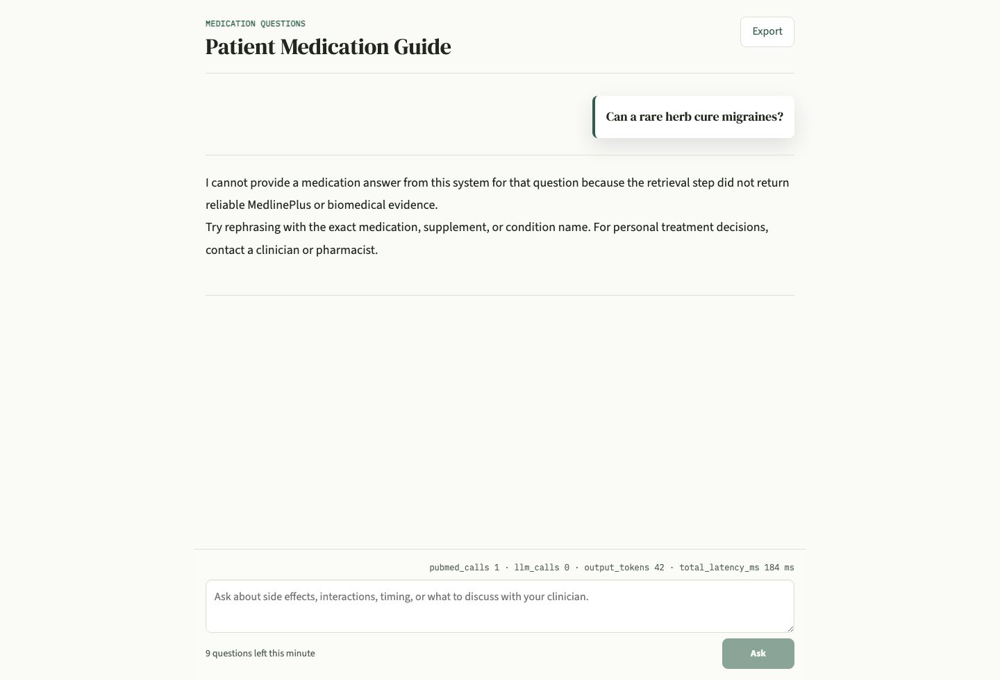
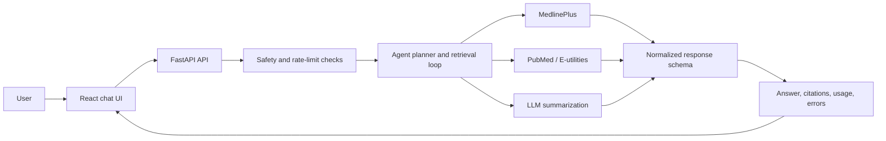

# Medication Evidence Assistant

A medication information assistant whose backend pulls live data from a public medical database, cleans it into one fixed format, and only then lets the language model answer. The backend is Python and FastAPI, the chat UI is React.

I built it to answer a practical question: can a medication assistant be useful without pretending to be a doctor? The agent path queries MedlinePlus, maps every page into one article record, and returns answers with citations, disclaimers, and a structured abstention when a source or model path fails.

## Demo

Representative local screenshots from the React chat UI:





I picked these two because they are the paths I cared most about: a source-linked medication answer, and a failure where the API returns an abstention instead of inventing medical guidance.

## What It Does

- Runs a local product stack with Docker Compose.
- Serves a React/Vite chat UI on `http://localhost:3000`.
- Serves the FastAPI backend on `http://localhost:8000`.
- Uses MedlinePlus for consumer-friendly medication information.
- Supports PubMed/E-utilities and a medical retrieval pipeline for evidence-oriented workflows.
- Streams agent responses with stage events, citations, usage metadata, and terminal error handling.
- Includes rate limiting, CORS controls, medical guardrail hooks, monitoring helpers, and sessions saved as JSON files on disk. There is no database.

## Technical Highlights

- I treat the LLM as one step in a retrieval pipeline, not as the source of truth. Retrieval results, citations, usage data, and error metadata stay visible to the API consumer.
- Docker Compose runs the FastAPI service and React frontend together, so the project runs locally without hand-wiring ports or startup commands.
- I wanted failure to be visible rather than hidden. If retrieval or generation cannot produce a supported answer, the API returns structured errors or an abstention response instead of crashing or fabricating.
- The backend suite is 617 passing pytest tests with 87.2% line coverage across the agent, API, evidence, and medical retrieval packages.
- Every retrieval backend is mapped into the same article record before anything downstream sees it, so the source layer can move from MedlinePlus to PubMed or another provider without changing the response shape.
- Structured logging and monitoring helpers track endpoint health, alerts, quotas, credits, latency, tool calls, and troubleshooting metadata.

## Architecture



Code map:

- `frontend/`: React chat client
- `src/api/`: FastAPI app, routes, and rate limiting
- `src/agent/`: planner, evaluator, tools, streaming loop, and sessions
- `src/evidence/`: evidence policy, scoring, query building, and schemas
- `src/medical_retrieval/`: medication retrieval, claim generation, and verification
- `src/clients/`: OpenAI-compatible LLM clients
- `src/monitoring/`: alert, quota, credit, and endpoint health helpers
- `tests/`: backend unit, integration, API, and domain tests

The main Docker path runs `uvicorn src.api.app:app` for the API and builds the frontend from `frontend/`.

## Quick Start

```bash
cp .env.example .env
docker compose up --build
```

Then open:

- Frontend: `http://localhost:3000`
- API health: `http://localhost:8000/api/health`
- API docs: `http://localhost:8000/docs`

## Local Development

Backend:

```bash
python -m venv .venv
source .venv/bin/activate
python -m pip install --upgrade pip
python -m pip install -r requirements.txt -r requirements-dev.txt
uvicorn src.api.app:app --reload --host 0.0.0.0 --port 8000
```

Frontend:

```bash
cd frontend
npm ci
npm run dev
```

## Tests

```bash
python -m pytest -q
python -m pytest --cov=src --cov-report=term
cd frontend && npm test && npm run typecheck
```

Backend result on 10 September 2026:

- `617 passed, 1 skipped`
- `84.6%` coverage across `src/agent` and `src/api`
- `87.2%` coverage across `src/agent`, `src/api`, `src/evidence`, and `src/medical_retrieval`

## Safety

This project gives general medication information with supporting references. It is not a diagnostic, prescribing, or emergency-care system. Responses carry source context and medical disclaimers, and the API exposes structured error or abstention paths instead of silently fabricating an answer when evidence is unavailable.

## License

MIT. See `LICENSE`.
